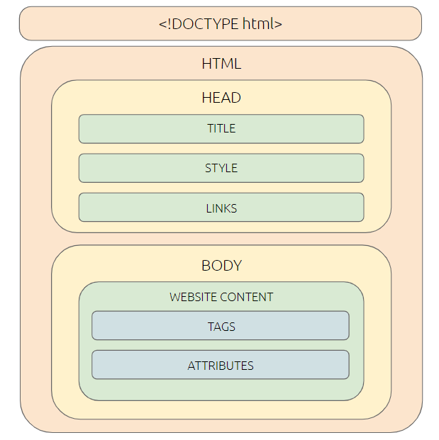

# Introduction to HTML

### Introduction
HTML is a markup language, which means that it transport media and information to the web. Most websites that you encounter use HTML to show you text, images, videos, and other!

HTML stands for...
> **H**yper
> **T**ext
> **M**arkup
> **L**anguage

HTML is the best place to start to begin your web development journey. In this unit, we will learn about the basics of HTML and create our very first websites!

### Advantages of HTML
What are the benefits of using HTML over other markup languages?

| Number | Advantage |
| ----------- | ----------- |
| Advantage 1 | HTML is easy to learn and simple to use/edit |
| Advantage 2 | HTML is free and supported by all browsers |
| Advantage 3 | HTML can be used in combination with other languages easily. |
| Advantage 4 | HTML is lightweight and the basis for most web related services. |
| Advantage 5 | HTML is the most friendly search engine. |
| Advantage 6 | Almost every website you access is made by HTML! |

### Structure of an HTML Document
An HTML document has many components. Below is a visual. As we advance through the HTML tutorial, you will become familiar with the different components.



### Tags

HTML is based on XML, a data language, so the way you use HTML is by writing different tags that describe what you want show on a screen

Tags are hidden keywords that tell HTML what an element is. They show what feature needs to be implemented. Different tags mean different results.

There are many different tags that you can use in HTML!

##### Example Tag

```html
<h1>Hello HTML Heading</h1>

```
###### This creates a header tag on the page that states, "Hello HTML Heading"


#### Important! *Every HTML tag must have a starting and closing tag. This is the ensure that browser knows where different elements start and end. An ending tag is the same as the starting, but it starts with a "/" added at the end.*


### The Most Basic HTML Entity: Text
When you are writing a website, most of your content will be in plain text. HTML gives you many different ways to deal with text, but the two most useful ways is heading and paragaphs.

The heading tags are H1, H2, H3, H4, H5 and H6. H1 is the biggest and it decreases size as you increase the number.

However, the syntax remains the same:
```html
<h1>H1 - Biggest</h1>
<h1>H2</h1>
<h1>H3</h1>
<h1>H4</h1>
<h1>H5</h1>
<h1>H6 - Smallest</h1>

```

Headers are always slightly bolded, like the title on an essay or an article you are reading. However, if you want to write normal text, you have to go to the paragraph tag. It looks like this:

```html
<p>THis is my first paragraph!</p>
```

Now, you have understood some of the core concepts of HTML. In the next lesson, you will learn about some of the useful HTML tags